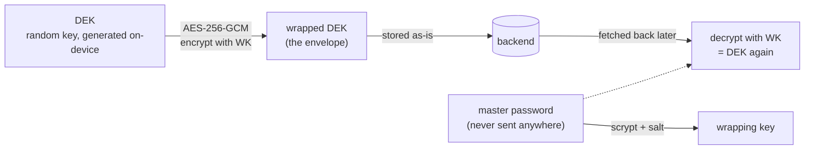
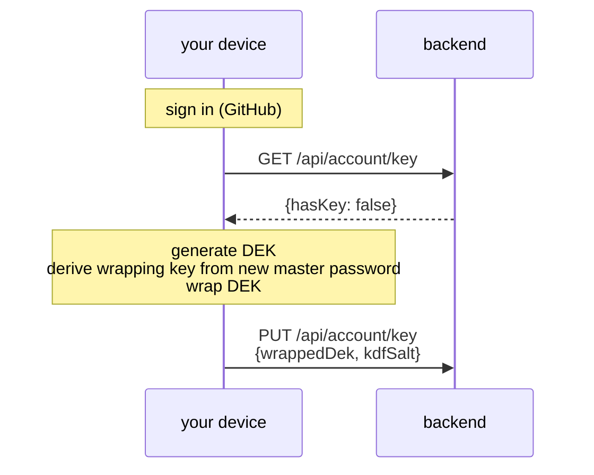
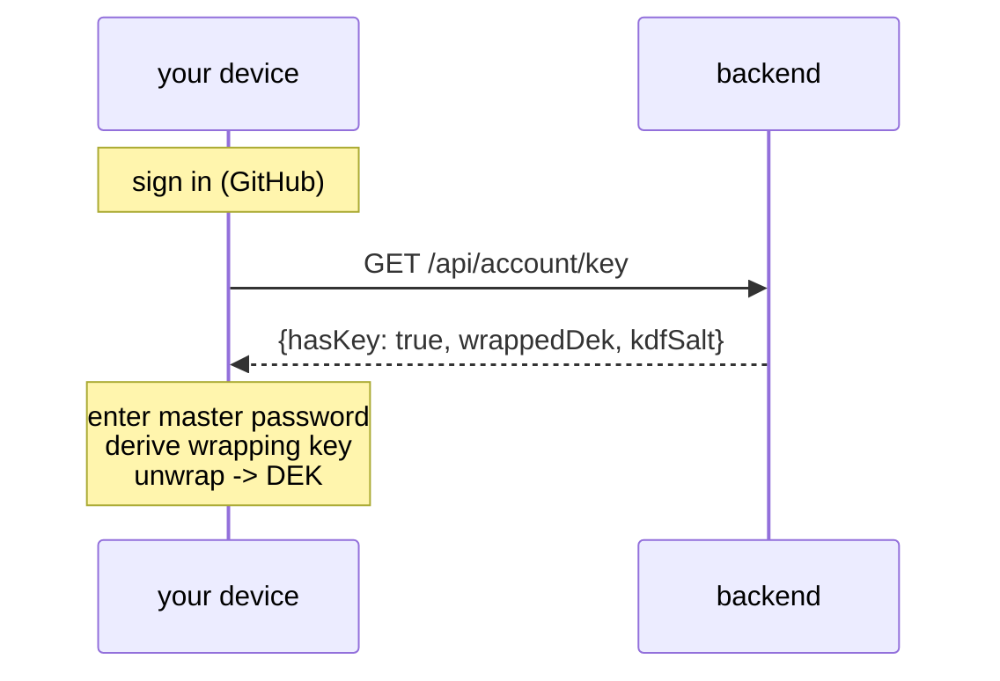
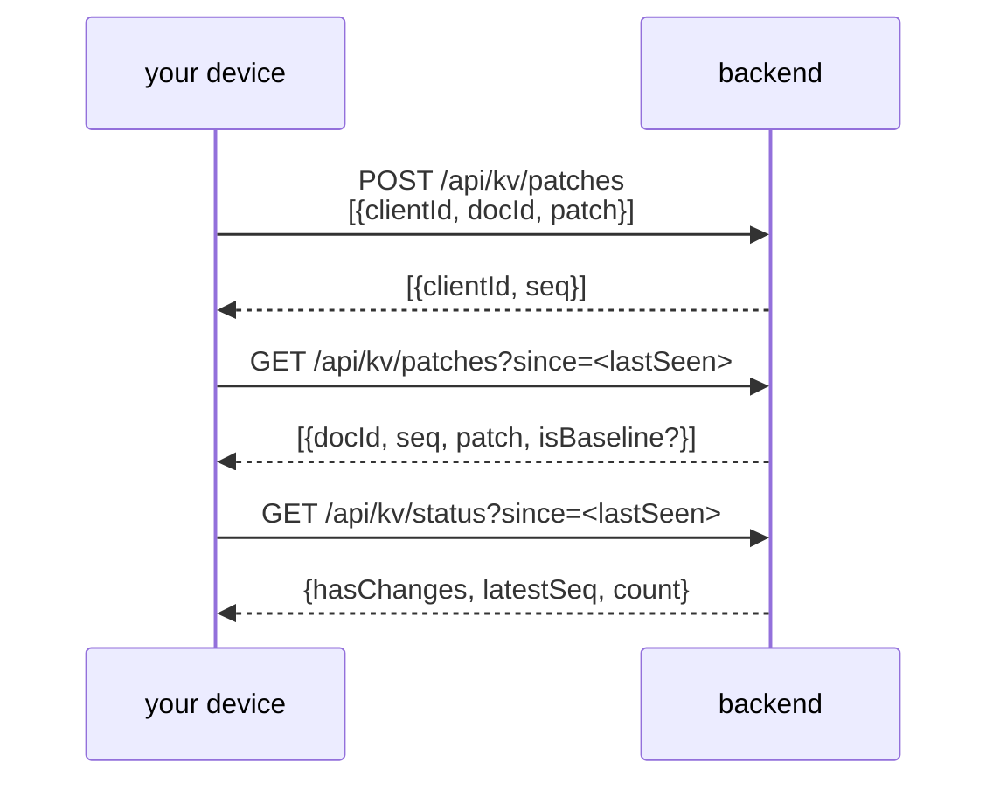
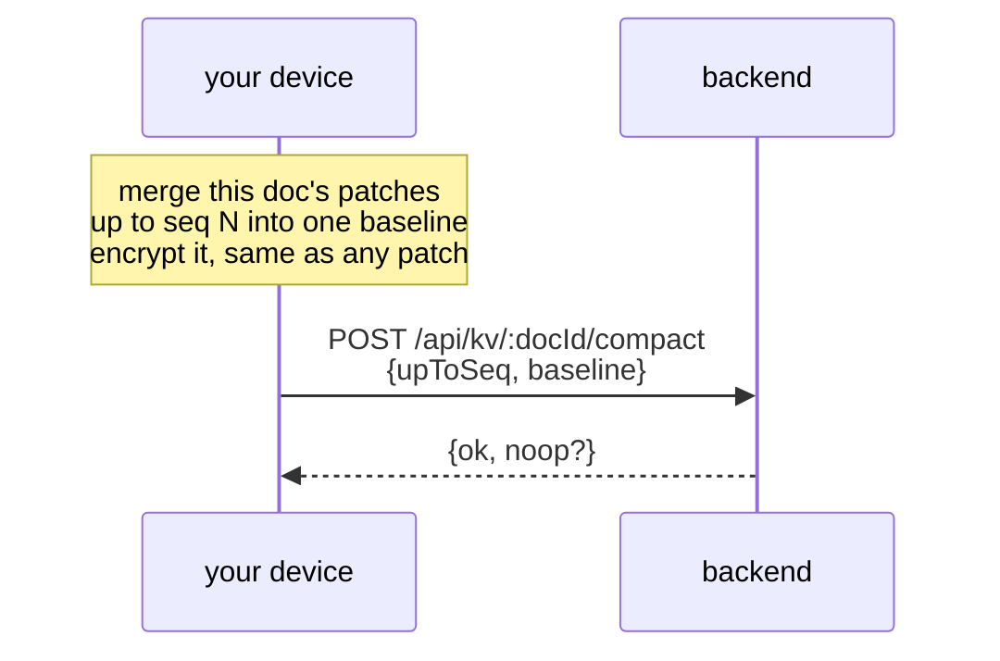

# Sync backend

## Introduction

The backend must store something to make cross-device sync possible, but it should
never be able to read the data it stores. To achieve this, the client encrypts data
locally before sending it. The server only ever stores and relays ciphertext; it holds
no key capable of decrypting it.

## Some terms first

- **End-to-end encryption (E2E)**: data is encrypted before it leaves the device and
  only decrypted on another device the user controls. The server in the middle only
  ever handles ciphertext.
- **DEK (Data Encryption Key)**: the key that actually locks and unlocks the data. It's
  a random key generated on-device, not derived from the password.
- **Envelope encryption**: rather than sending the DEK anywhere as-is, it's locked
  inside another layer of encryption (an "envelope") before it's allowed to touch the
  server. The server stores the locked envelope, never the key inside it.
- **Wrapped DEK**: the DEK after that envelope step, encrypted using a key derived from
  the master password. "Wrapped" means "encrypted, so it's safe to store or send
  somewhere less trusted." The backend only ever stores this wrapped form; it cannot
  unwrap it, since it never has the password.
- **AES-256-GCM**: the encryption algorithm used throughout this system. GCM also
  produces an authentication tag, so a tampered or corrupted ciphertext fails to decrypt
  loudly instead of silently returning garbage.
- **AAD (associated data)**: context (here, which document a patch belongs to) that's
  bound into the encryption without being part of the secret payload. Relabeling
  encrypted data as belonging to a different document makes decryption fail.

## Envelope encryption



The master password never leaves the device; only a key derived from it (via scrypt) is
used, and only locally. The backend's role is limited to storing the wrapped DEK (an
opaque blob) and returning it on request; it plays no part in locking or unlocking it.
Losing the master password makes the wrapped DEK permanently unusable. There is no
server-side reset, by design.

## First-time login: creating a master password

The first time a user signs in on a new account, no DEK exists yet, since nothing has
been encrypted for them before. The app asks for a master password at that point and
uses it to create the envelope:



From then on, that account has an envelope stored on the server. Signing in again, on
the same device or a new one, looks like this instead:



Entering the wrong master password simply fails to unwrap (the GCM auth tag won't
verify). There is no server-side way to check whether a master password is correct,
which is the intended behavior.

## Syncing your changes

App data changes are small binary patches. Each one is encrypted client-side with the
DEK before being sent, and only decrypted client-side after being received. The backend
stores and forwards the encrypted blob as-is and assigns it a sequence number for
ordering, but cannot read it:

```
encrypt(patch):
  iv         = random 12 bytes
  ciphertext = AES-256-GCM(key = DEK, iv, AAD = document id, plaintext = patch)
  send         iv + authTag + ciphertext, base64-encoded
```



- **Push**: send new local patches, get back the sequence numbers the backend assigned
  them.
- **Pull**: ask for anything newer than the last sequence number seen.
- **Status**: a cheap check for whether anything new exists (counts only, no patch
  data), so the app can show "N changes available" without downloading or decrypting
  anything.

## Compaction

Over time a document accumulates a long trail of small patches, and replaying all of
them just to read the document gets slower as that trail grows. Compaction merges a
document's patches into one baseline, client-side, and uploads that instead:



`baseline` is encrypted exactly like a regular patch; compaction changes how much data
moves, not who can read it. `noop: true` means another device already compacted at
least that far; the caller still trims its own local copy of the now-redundant patches
either way. Once compacted, pulling that document later means fetching one blob instead
of replaying its whole history.
