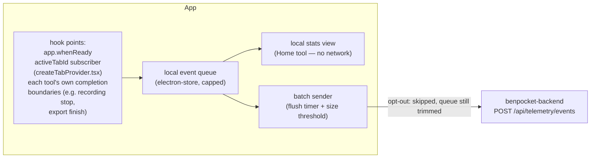

# Usage tracking

## Why

BenPocket has no visibility into which tools actually get used. Tracking opens
and coarse usage serves two purposes:

- **Roadmap decisions** — which tool deserves the next round of investment.
- **Personal encouragement** — a small "you've built something people open
  every day" signal.

It's opt-out, not opt-in — a visible toggle, on by default, one click to
disable, with a first-run notice (not a blocking modal). Opting out rotates
the anonymous install ID and drops any queued events. The toggle lives in Home
until a dedicated Settings tool exists (see
[How to use it](#how-to-use-it)).

## What we don't track

BenPocket is local-first and privacy-respecting (see
[sync-backend.md](../sync-backend.md) — the sync backend can't read user data
even if it wanted to). Bolting on a conventional analytics SDK would undercut
that, so this stays narrow: count opens and coarse usage, nothing about
content, no session replay/funnels/heatmaps, no third-party SDK
(PostHog/Amplitude/etc.). Explicitly **not** collected, ever:

- Request/collection contents, file paths, pod names, screenshots, recording
  content, clipboard — anything that is the _data the tools operate on_.
- Free-text, error messages, stack traces (those belong in a separate,
  explicitly-consented crash-report flow if we ever want one — not this).
- Any identifier tied to the GitHub account used for sync, and no cross-device
  stitching by account — telemetry identity and account identity are kept
  deliberately unlinked (see [Identity](#identity-anonymous-install-id-not-account-id)).
- IP address beyond whatever the HTTP layer sees in transit — not stored
  against the event.

## Identity: anonymous install ID, not account ID

A random `installId` (`crypto.randomUUID()`) is generated on first run and
stored in the app-wide electron-store settings (not inside any profile's
synced Yjs doc — telemetry must keep working for local-only profiles that have
no account at all, and must _not_ become another thing that syncs across
devices under an account). It:

- Is not derived from and never combined server-side with the GitHub identity
  used for `RemoteSyncProvider` — the sync backend and the telemetry backend
  should not be joinable by a shared key.
- Resets to a new random value whenever the user opts out and later opts back
  in — no resurrecting the old history.
- Is visible and copyable in the settings UI ("Your install ID: `xxxx`, reset")
  so it isn't a hidden fingerprint.

`sessionId` is a fresh UUID per app launch, held in memory only, for grouping
events within one run without needing wall-clock stitching.

## Architecture



The queue is the single source for two independent consumers:

1. **Local stats** — a simple "most-used tools this month" view in Home,
   computed entirely on-device from the queue. Works even fully opted out,
   since it never leaves the machine — this is the "encouragement" half of the
   goal and doesn't need the network at all.
2. **Batch sender** — periodically drains the queue to the backend. Skipped
   entirely when the user has opted out; the queue is still trimmed locally so
   it doesn't grow unbounded.

## Client-side batching

- Persisted queue (electron-store), capped at ~500 events; drop oldest on
  overflow.
- Flush on a ~30–60s interval, plus one best-effort attempt on app quit
  (`before-quit`, ~2s bound, never blocks shutdown).
- One batched `POST` per flush, not one request per event.
- On failure, leave events queued and retry next tick.
- Enqueue is synchronous and cheap; sending is fire-and-forget, never on the
  UI's critical path.

## Backend endpoint

New unauthenticated `POST /api/telemetry/events` route — no login required,
since local-only profiles have no account and telemetry shouldn't become
another path linking install ID to account identity. Body:
`{ installId, appVersion, platform, events: [...] }` (event shapes in the
[Event catalog](#event-catalog)); responds `202 Accepted`, no per-event acks —
a dropped batch is just a small gap in usage data, not lost data.

Guardrails: cap batch size, basic per-IP rate limiting, validate `event`
against the [Event catalog](#event-catalog) and drop unknown fields, expire
raw rows past a bounded retention window (e.g. 90 days).

### Storage

One D1 database, one table per event type — typed columns rather than a
generic `events` table with a JSON payload, so the event name doubles as the
allowlist check (unrecognized event = no table to insert into) and rollups
stay plain SQL. Each table carries `install_id`, `session_id`, `ts`, plus that
event's own fields from the Event catalog — e.g. `tool_opened` adds `tool`;
`screen-recorder:export` adds `format`, `duration_sec`, `preset_id`,
`clip_count`, and the `has_*` feature-usage flags.

A daily job aggregates all of them into one shared `daily_tool_stats` table
(`date`, `event`, `tool`, `count`, `sum_duration_sec`) and then prunes raw rows
past the retention window — so long-term trends survive even after the raw,
per-event rows age out.

## How to use it

```ts
window.telemetry.send({ event: 'screen-recorder:export', format: 'mp4', durationSec: 12 });
```

`TelemetryEvent` is a discriminated union, one variant per row in the
[Event catalog](#event-catalog) — wrong fields for an `event` is a type error,
and a new event needs a variant here before any call site can use it:

```ts
export type TelemetryEvent =
  | { event: 'app_opened' }
  | { event: 'tool_opened'; tool: string }
  | {
      event: 'screen-recorder:record';
      durationSec: number;
      sourceType: 'screen' | 'window';
      micEnabled: boolean;
      systemAudioEnabled: boolean;
      webcamEnabled: boolean;
    }
  | {
      event: 'screen-recorder:export';
      format: 'mp4' | 'webm' | 'mov' | 'gif';
      durationSec: number;
      presetId: 'web' | 'social' | 'email' | '4k-master' | 'gif' | 'custom';
      clipCount: number;
      hasAnnotations: boolean;
      hasCaptions: boolean;
      hasBlurMask: boolean;
      hasZoom: boolean;
      hasCustomBackground: boolean;
      hasWebcamOverlay: boolean;
    }
  | { event: 'screen-recorder:export_failed' }
  | { event: 'screen-capture:capture' }
  | { event: 'http-client:request' };

export interface TelemetryApi {
  send: (event: TelemetryEvent) => void;
  getOptIn: () => Promise<boolean>;
  setOptIn: (optIn: boolean) => Promise<void>;
  getInstallId: () => Promise<string>;
  resetInstallId: () => Promise<string>;
}
```

`send` is `ipcRenderer.send` (fire-and-forget, not `invoke`); the main process
fills in `sessionId`, `ts`, `installId`, `appVersion`, and `platform`.

Call sites: `app.whenReady()` → `app_opened`; the `activeTabId` subscriber in
`createTabProvider.tsx` (not `openTab`, which fires per new tab rather than
per tool) → `tool_opened`, once per tool per session; each tool's own
completion boundary (recording stop, export finish, capture taken, request
sent) → its namespaced event.

## Event catalog

Every event carries `sessionId`, `ts`, `installId`, `appVersion`, and
`platform` regardless of type. Tables below list only the fields specific to
that event.

### `app_opened`

No event-specific fields.

Purpose: daily/weekly active installs.

### `tool_opened`

| Field  | Type   | Notes                                                     |
| ------ | ------ | --------------------------------------------------------- |
| `tool` | string | e.g. `http-client` — matches `allTools` in `AllTools.tsx` |

Purpose: which tools get used. Fires once per (tool, session) — the first
time a tool becomes the active tab in a session, whether via a brand-new tab
or switching to an already-open one — never once per `openTab` call.

### `screen-recorder:record`

| Field                | Type    | Notes                                                                         |
| -------------------- | ------- | ----------------------------------------------------------------------------- |
| `durationSec`        | integer | the recording's own start/stop, already computed in `recording-controller.ts` |
| `sourceType`         | string  | `screen` / `window` (`CaptureSource.type`) — never the window/app name        |
| `micEnabled`         | boolean | `AudioInputOptions.microphoneEnabled`                                         |
| `systemAudioEnabled` | boolean | `AudioInputOptions.systemAudioEnabled`                                        |
| `webcamEnabled`      | boolean | `WebcamOptions.enabled`                                                       |

Purpose: a completed recording, plus which capture modes people actually use —
informs whether webcam/system-audio/window-capture work is worth more
investment.

### `screen-recorder:export`

| Field                 | Type    | Notes                                                                             |
| --------------------- | ------- | --------------------------------------------------------------------------------- |
| `format`              | string  | container only — `mp4` / `webm` / `mov` / `gif` — never output path or filename   |
| `durationSec`         | integer |                                                                                   |
| `presetId`            | string  | `EXPORT_PRESETS` id (`web` / `social` / `email` / `4k-master` / `gif` / `custom`) |
| `clipCount`           | integer | `segments.length` — coarse trim/split signal, never the cut points themselves     |
| `hasAnnotations`      | boolean | annotation track non-empty                                                        |
| `hasCaptions`         | boolean | captions track non-empty                                                          |
| `hasBlurMask`         | boolean | blur-mask track non-empty                                                         |
| `hasZoom`             | boolean | zoom keyframes present                                                            |
| `hasCustomBackground` | boolean | background changed from default                                                   |
| `hasWebcamOverlay`    | boolean | webcam composited into the project                                                |

Purpose: a completed export, plus which editing features and presets actually
get used before export — the strongest "what to build next" signal for the
most feature-rich tool in the app. All fields are booleans/enums/counts, never
content.

### `screen-recorder:export_failed`

No event-specific fields — count only. Deliberately does **not** carry
`ExportProgress.error`; an error message is exactly the kind of free text this
system excludes (see [What we don't track](#what-we-dont-track)) and belongs
in a separate, explicitly-consented crash-report flow if we ever build one.

Purpose: export reliability signal without any error content.

### `screen-capture:capture`

No event-specific fields — count only, no duration concept applies.

### `http-client:request`

No event-specific fields — count only, never URL/method/headers/body.
